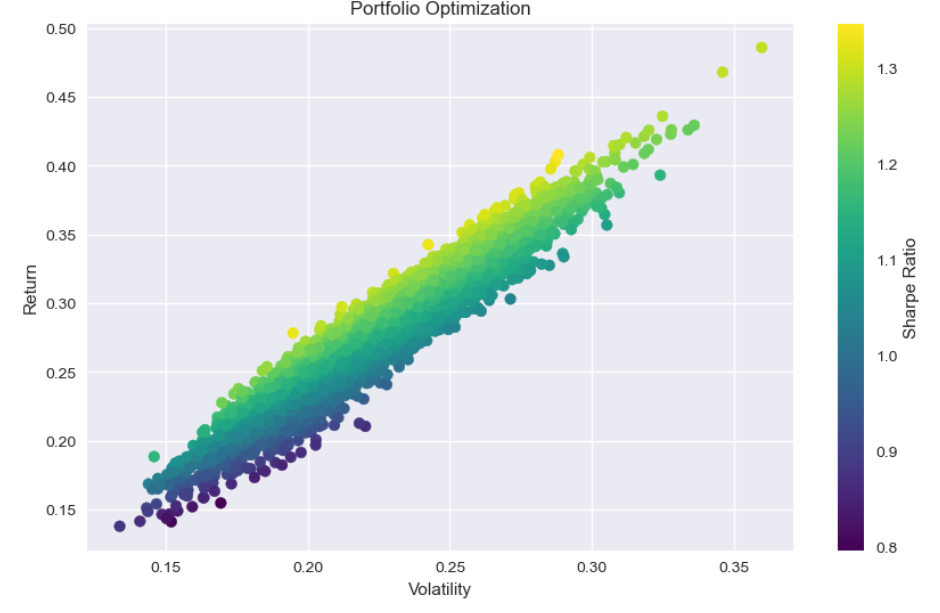
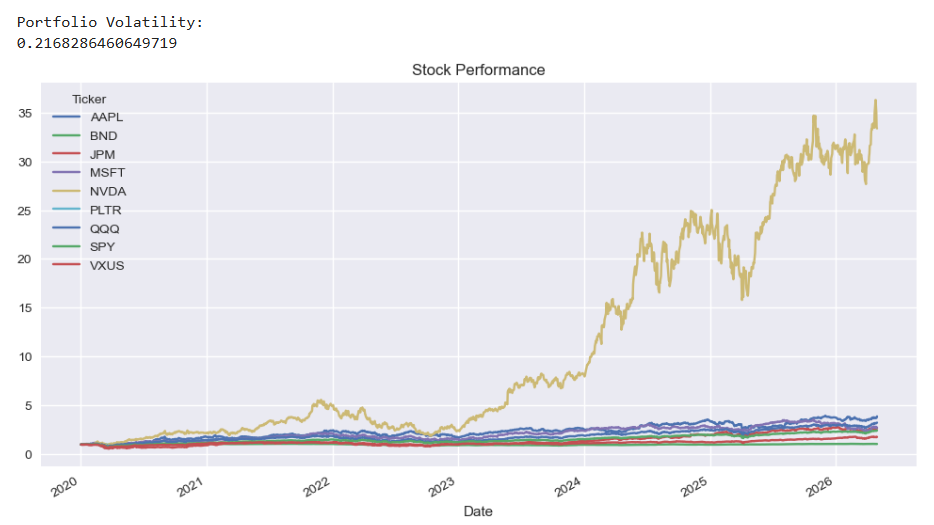
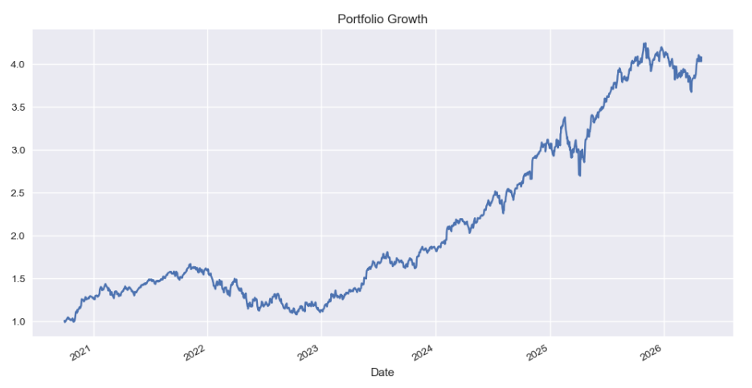

# Portfolio Optimization with Python

This project builds and analyzes a diversified portfolio using real market data.

## Overview
- Built using modern portfolio theory concepts
- Pulled historical stock data using yfinance
- Calculated daily returns and volatility
- Constructed a multi-asset portfolio (equities, ETFs, bonds)
- Evaluated performance using Sharpe Ratio
- Simulated 5000 portfolios to find optimal allocation

## Results

## Tools Used
- Python
- Pandas
- NumPy
- Matplotlib

## Key Insight
Demonstrates the trade-off between risk and return and how diversification improves portfolio stability.
